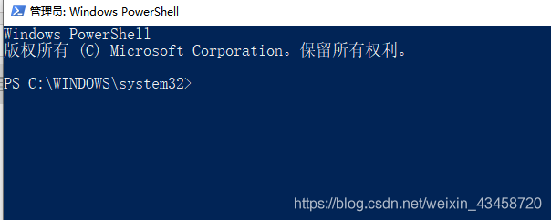
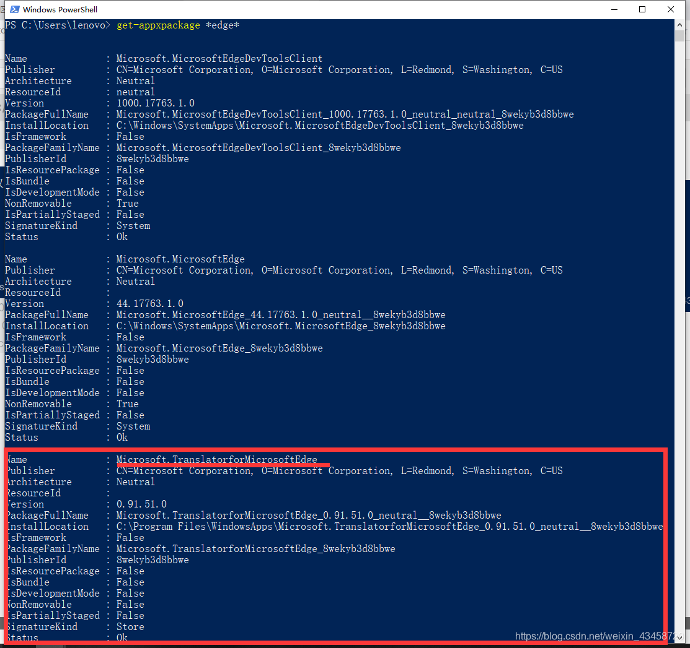
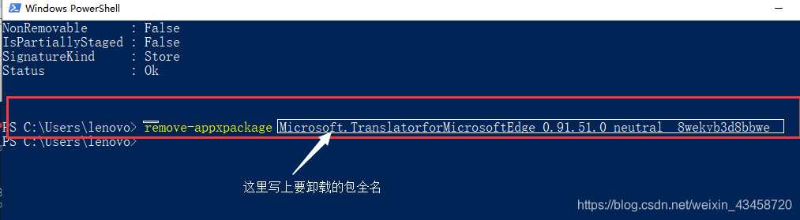

# 使用Powershell卸载windows默认程序

## 管理员身份打开Powershell
输入 <kbd>Win</kbd> 键打开开始菜单，输入Powershell，然后选择管理员身份运行。

显示：左键单击Windows Powershell（管理员）



## 寻找你要卸载的程序

（这里以TranslatorforMicrosoftEdge为例）

你可能记不住程序的全名，使用*进行代替,进行模糊搜索，其实除了程序开发者外的其他人，或许没有人能够记住程序的全名了吧！！

使用get-appxpackage *edge*命令进行模糊搜索（你想要卸载什么程序就将edge换为什么程序）
PS：get-appxpackage [你要卸载的程序]


复制`PackageFullName`（包全名）备用在这个例子中即

```powershell
Microsoft.TranslatorforMicrosoftEdge_0.91.51.0_neutral_8wekyb3d8bbwe
```

如图



## 使用命令卸载程序

1、remove-appxpackage [你要卸载的包全名]

2、打回车<kbd>Enter</kbd>

3、程序自动卸载

