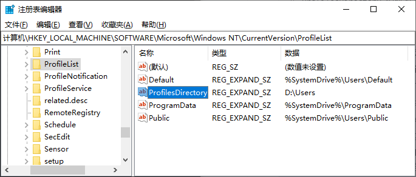
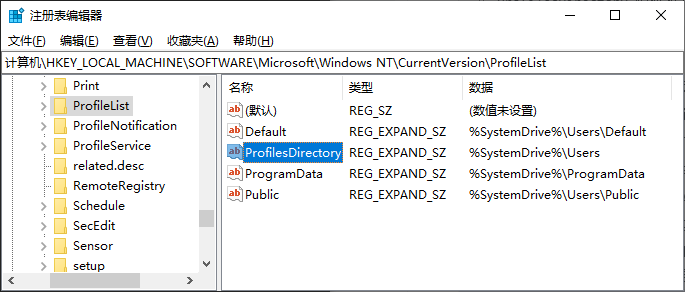

# Windows通过修改注册表更改用户家目录

系统盘为C盘，C盘空间不足，C盘太满了，C盘清理时查看发现`C:\Users`目录占用几十个GB，以下方法可将`Users`目录大部分空间转移。

### 1. 准备工作

更改/迁移用户目录之前先自行备份当前用户的资料（下载目录、桌面文件等），以免数据丢失！！！

### 2. 修改注册表

更改默认用户目录路径，快捷键`Win+R`输入`regedit`打开系统注册表，切换至如下路径：

```BAT
HKEY_LOCAL_MACHINE\SOFTWARE\Microsoft\Windows NT\CurrentVersion\ProfileList\
```

将`ProfilesDirectory`项改为将要迁移的路径，例如`D:\Users`；



然后进入系统`控制面板`新建一个新系统账户，并设置为管理员；

重启电脑后使用新账户登录，这样新账户的用户目录就自动切换到`D:\Users\[新账户]`目录。

*（如果想新账户名跟原来的账户名保持一致，那么在建新账户之前先删除旧账户（自行备份资料），重启电脑确保旧账户被清空，再重新建立一个同样名字的新账户，再继续执行上述步骤即可。）*

### 3. 还原注册表

完成目录切换后，为避免更改的注册表引发其他问题，还需将注册表的`ProfilesDirectory`项还原成`%SystemDrive%\Users`，如下：



做完这一步，**用户目录更改/迁移就已经完成了**；文章后面的内容为补充内容，有兴趣的朋友可以看看。

### 4. 补充信息

注册表中会记录已经登录过的用户以及用户配置文件路径，打开注册表路径：

```BAT
HKEY_LOCAL_MACHINE\SOFTWARE\Microsoft\Windows NT\CurrentVersion\ProfileList\
```

展开该路径显示子项，左边长串数字的子项就是系统所有的用户项。


### 5. 其他方法

尝试通过`mklink`建立文件夹软链接替换`C:\Users\[xxx]`；但是`xcopy`和`robocopy`命令拷贝`C:\Users\[xxx]`时总会有文件拷贝失败，导致系统库(`AppData\Local\Microsoft`等)异常，此方法无效。