# Zabbix构建企业级监控告警平台

## Zabbix 构建企业级监控告警平台

### 一. 简介

Zabbix 是一个基于 WEB 界面的提供分布式系统监视以及网络监视功能的企业级的开源解决方案。它能监视各种网络参数，保证服务器系统的安全运营；并提供灵活的通知机制以让系统管理员快速定位/解决存在的各种问题。

### 二.监控对象

----

源代码: *.html *.jsp *.php *.py
数据库： MySQL,MariaDB,Oracle,SQL Server,DB2
应用软件：Nginx,Apache,PHP,Tomcat agent

---------

集群： LVS,Keepalived,HAproxy,RHCS,F5
虚拟化层/云层： VMware,KVM,XEN agent
操作系统：Linux,Unix,Windows性能参数

----

硬件： 服务器，存储 IPMI
网络： 网络环境（路由器，交换机，防火墙，内网环境，外网环境） SNMP

----

### 三.监控收集信息方式

    被动模式
    主动模式

### 四.Zabbix 部署

#### zabbix-server(192.168.100.10)

##### 1.官网：我是链接
##### 2.环境

  IP	主机名	角色
  192.168.100.10	zabbix_server	监控服务器
  192.168.100.20	web1	业务主机

#####   3.Installing Zabbix packages

  ①.设置主机名

    hostnamectl set-hostname zabbix_server

②.防火墙

    systemctl stop firewalld.service
    systemctl disable firewalld.service

③.selinux

    setenforce 0
    永久关闭 
    sed -ir '/^SELINUX/cSELINUX=disabled' /etc/selinux/config

④.准备Zabbix-repo

    rpm -Uvh https://repo.zabbix.com/zabbix/4.0/rhel/7/x86_64/zabbix-release-4.0-2.el7.noarch.rpm   
    
    rpm -Uvh https://repo.zabbix.com/zabbix/5.0/rhel/7/x86_64/zabbix-release-5.0-1.el7.noarch.rpm
    yum clean all 


国外镜像特别慢，可以使用阿里提供的zabbixYUM源。在epel中就有40版本
⑤.安装Zabbix服务器

    yum -y install zabbix-server-mysql zabbix-web-mysql zabbix-agent zabbix-get.x86_64

zabbix-server-mysql：数据库
zabbix-web-mysql：WEB
zabbi-agent：代理程序（上报信息的程序）

##### 4. Creating initial database

①.安装数据库

 yum -y install mariadb mariadb-server

②.启动数据库

    systemctl enable mariadb
    
    systemctl start mariadb

③.授权zabbix账号

    mysql
    create database zabbix character set utf8 collate utf8_bin;
    create user zabbix@localhost identified by '123456';
    grant all privileges on zabbix.* to zabbix@localhost;
    
    flush privileges;

##### 5.Starting Zabbix server process

①.配置sql账号密码

    导入初始架构和数据，系统将提示您输入新创建的密码。
    zcat /usr/share/doc/zabbix-server-mysql*/create.sql.gz | mysql -uzabbix -p zabbix
    vim /etc/zabbix/zabbix_server.conf
    DBPassword=zxc123

②.启动zabbix

    systemctl restart zabbix-server zabbix-agent httpd
    systemctl enable zabbix-server zabbix-agent httpd

③.Editing PHP configuration for Zabbix frontend
默认值，只需要配置时区。

    vim /etc/httpd/conf.d/zabbix.conf
    php_value date.timezone Asia/Shanghai
    
    systemctl restart httpd

安装后图形界面显示图形，文末有解决方案，php版本问题

升级php7.0即可，并重新安装zabbix-web

    [root@zabbix-server ~]# php -version
    PHP 7.0.33 (cli) (built: Dec  6 2018 22:30:44) ( NTS )
    Copyright (c) 1997-2017 The PHP Group
    Zend Engine v3.0.0, Copyright (c) 1998-2017 Zend Technologies
    with Zend OPcache v7.0.33, Copyright (c) 1999-2017, by Zend Technologies
    [root@zabbix-server ~]# rpm -qa zabbix-web
    zabbix-web-4.0.28-1.el7.noarch

##### 欢迎页面

> 在这里如果使用mysql 8.0的系统可能会报错 **The server requested authentication method unknown to the client**
>
> 发生这个问题的原因是在 mysql 8.0 以后，caching_sha2_password是默认的身份验证插件，而不是以往的mysql_native_password。在 MySQL Command Line 工具下修改 mysql 的默认身份验证插件即可。
>
> 解决方法 ALTER USER zabbix@'localhost'  IDENTIFIED WITH mysql_native_password BY 'passwd';

http://zabbix-server-ip/zabbix


##### 登录

用户名： Admin
 密码： zabbix


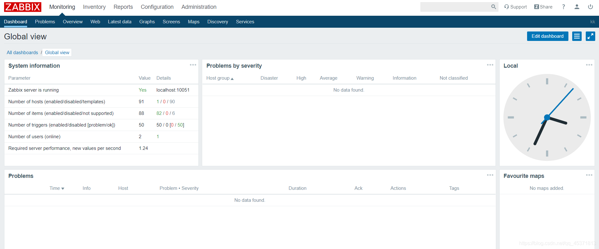

##### 语言和乱码

administration>users>admin user
右上角用户图标，更换语言


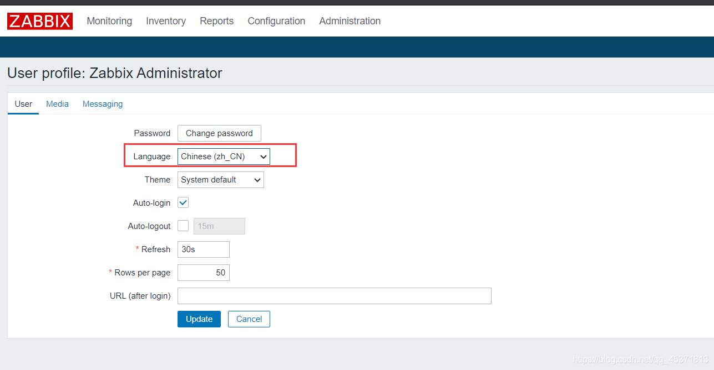


设置中文后，查看图形有乱码，文字变成了方块
解决方案
Win+R打开运行，输入fonts，回车进入Windows字体目录，找到微软雅黑-常规字体右键复制，找个文件夹，点击粘贴，复制出来将文件名修改为msyh.ttf，注意后缀ttf 只需要改一个

```cmd
C:\Windows\Fonts
```


将msyh.ttf上传到服务器zabbix字体目录中：/usr/share/zabbix/assets/fonts/
注意文件权限

    [root@zabbix_server fonts]# mv msyh.ttc msyh.ttf
    chmod 777  /usr/share/zabbix/assets/fonts/msyh.ttf

查看字体配置# grep FONT_NAME /usr/share/zabbix/include/defines.inc.php -n
执行快捷替换

    sed -i "s/graphfont/msyh/g" /usr/share/zabbix/include/defines.inc.php

确认是否替换成功

    grep FONT_NAME /usr/share/zabbix/include/defines.inc.php  -n
    45:define('ZBX_GRAPH_FONT_NAME',        'msyh'); // font file name
    93:define('ZBX_FONT_NAME', 'msyh');

字体配置修改成功后，刷新图形界面即可看到图形字体显示正常了。

#### zabbix-agent(192.168.100.20)

##### 安装和配置

①.设置主机名

    hostnamectl set-hostname  web1

②.防火墙

    systemctl stop firewalld.service
    systemctl disable firewalld.service

③.selinux

    setenforce 0

④.准备zabbix-repo

    rpm -Uvh https://repo.zabbix.com/zabbix/4.0/rhel/7/x86_64/zabbix-release-4.0-2.el7.noarch.rpm
    #rpm -ivh http://repo.zabbix.com/zabbix/4.4/rhel/7/x86_64/zabbix-release-4.4-1.el7.noarch.rpm

使用epel源中的zabbix版本
⑤.安装zabbix-agent

    yum -y install zabbix-agent

⑥.配置代理

    vim /etc/zabbix/zabbix_agentd.conf

说明：192.168.100.10是zabbix服务器的地址

```bash
Server=192.168.100.10,192.168.100.11 被动模式 zabbix-server-ip

ServerActive=192.168.100.10,192.168.100.11 主动模式 zabbix-server-ip （谁从我这里采集数据。）
Hostname=web1 建议使用 $HOSTNAME
```


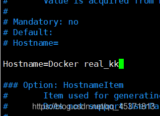

 ⑦.启动zabbix-agent：10050

```bash
systemctl start zabbix-agent
systemctl enable zabbix-agent
ss -anlp |grep :10050
```

服务器是10051

7.命令行测试

    [root@zabbix_server fonts]# yum install zabbix-get
    [root@zabbix ~]# zabbix_get -s 10.11.67.137 -k system.uname
    Linux server 3.10.0-693.el7.x86_64 #1 SMP Tue Aug 22 21:09:27 UTC 2017 x86_64
    [root@zabbix ~]# zabbix_get -s 10.11.67.137 -k system.cpu.load[all,avg15]
    0.050000
    [root@zabbix ~]# zabbix_get -s 10.11.67.137 -k net.tcp.service[http]
    1
    # 0假
    
    # 1真

##### Apache监控示例（图形监控）

###### 创建主机组 （zabbix-server-192.168.100.10）


选择默认模板，模板就是zabbix推荐的监控参数。（这样可以缩小选择范围)

###### 创建主机（zabbix-server-192.168.100.10）

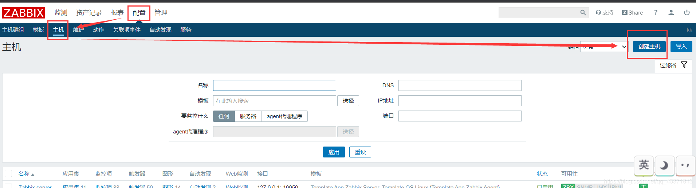

###### 选择群组


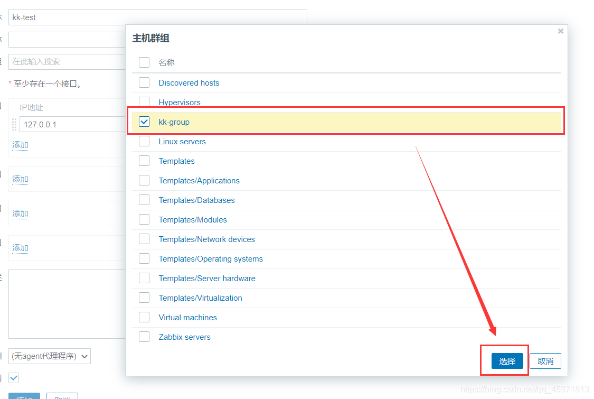


###### 创建图形（zabbix-server-192.168.100.10）


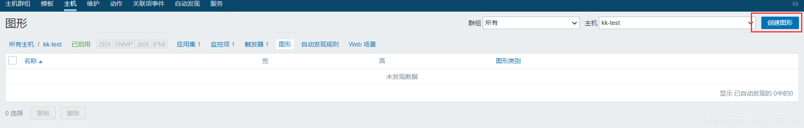


###### 模板Template

应用集（app）：对监控项的分类

监控项（item）：具体监控的项目 比例。。大小。。

图形：监控项产生的连续数据用图形表示

聚合图形：多个图形在一个页面显示

自动发现：自动发现主机并添加到组中


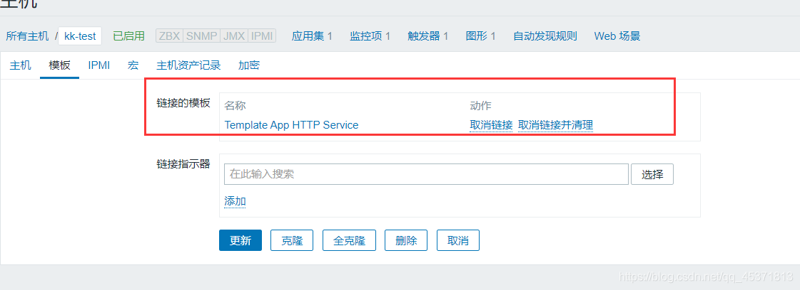

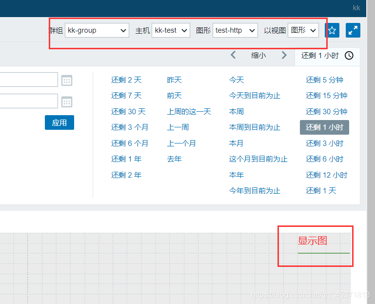

#### 报错及解决：

#####  安装zabbix4.0图形界面不显示图


解决：
 大佬提示php版本问题，yum安装为5.4 ，升级为7的版本测试

```bash
1.执行下面的命令升级软件仓库

rpm -Uvh https://mirror.webtatic.com/yum/el7/epel-release.rpm  

rpm -Uvh https://mirror.webtatic.com/yum/el7/webtatic-release.rpm 

2.删除PHP

yum remove php-common

3.安装php 5.6版本（php56w-devel不是必需）

yum install -y php56w php56w-opcache php56w-xml php56w-mcrypt php56w-gd php56w-devel php56w-mysql php56w-intl php56w-mbstring

4.重启Apache

 

安装PHP7

yum install php70w-fpm php70w-mysql php70w-mysqli php70w php70w-opcache php70w-gd php70w-intl php70w-mbstring php70w-exif php70w-mcrypt php70w-openssl

```

##### 安装zabbix 后进入graph界面 显示Fail

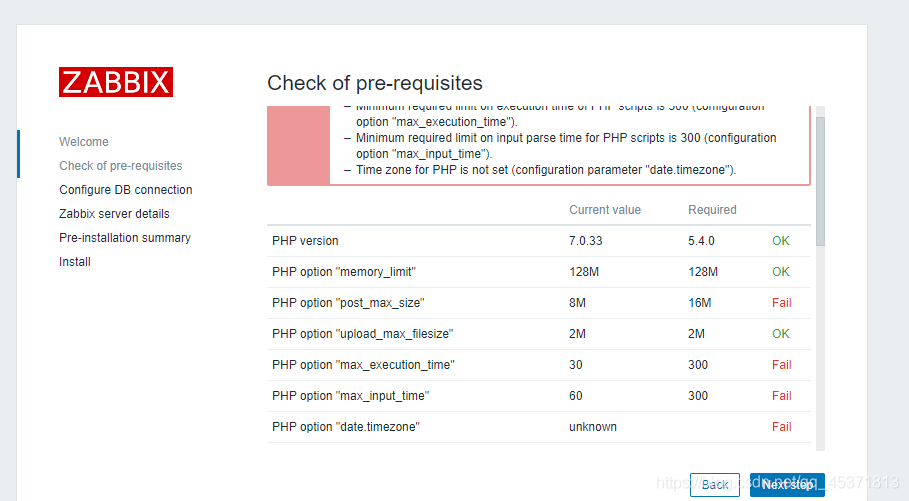

依据提示修改

```bash
vim /etc/php.ini
date.timezone = Asia/Shanghai
#重启php-fpm httpd
systemctl restart php-fpm
systemctl restart httpd


```


## Zabbix 构建企业级监控告警平台 2

### Zabbix Items 监控项

获取监控数据方式

```bash
zabbix-agent
SNMP 简单的网际发现协议
```

取值的数据类型、单位

监控key：是监控的内容 ，

获取数据的间隔：不能太小，1s 1m 

历史数据保存的时间：

趋势数据保存时间：

#### 新建item监控项

#### 监控项：服务器启动分区剩余空间

1、新建模板


2、创建监控项


3、新建图形

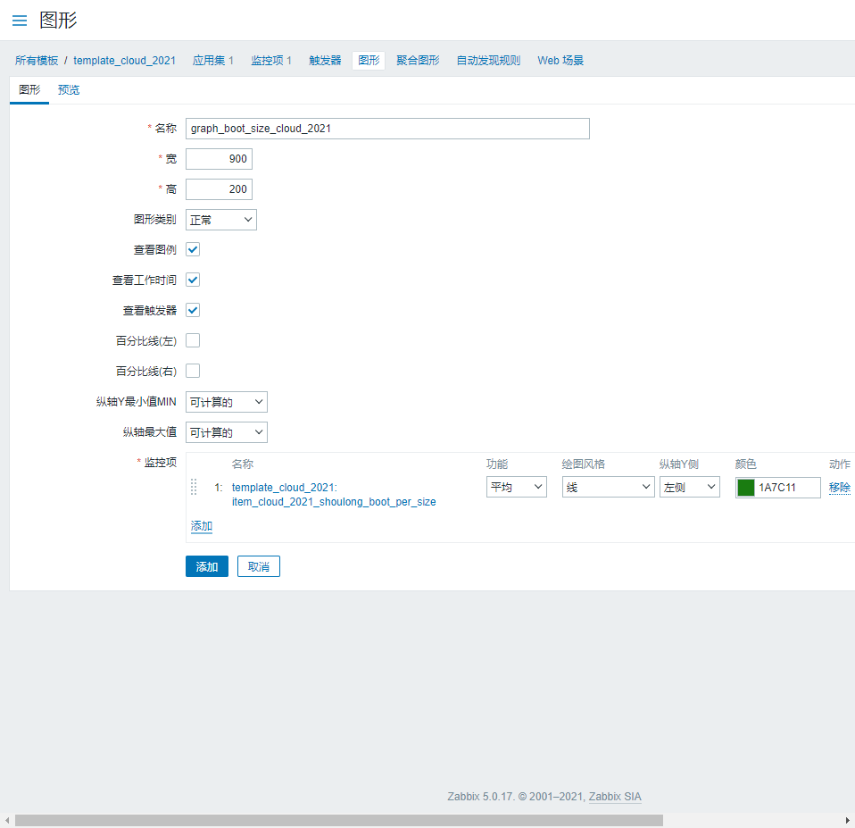

添加模板到主机

然后在检测：最新数据：查看图形

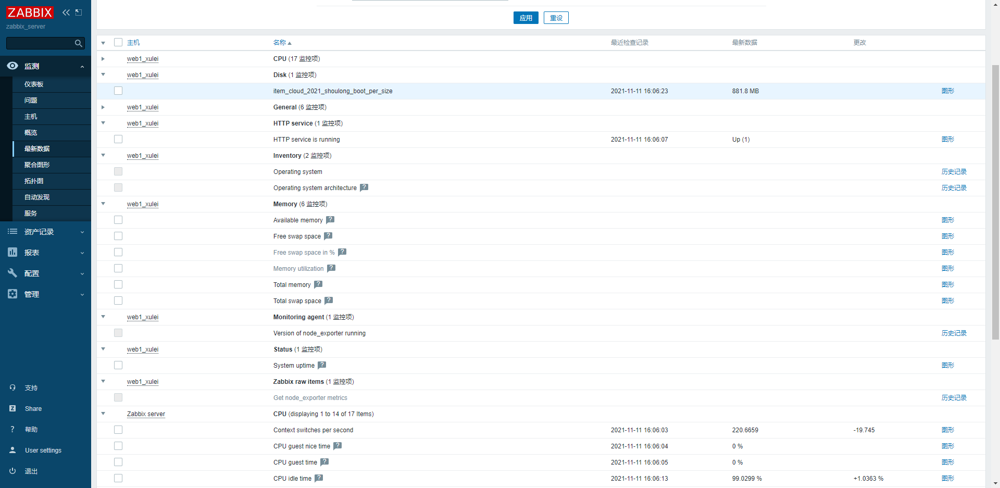

#### 监控项：服务器网络进出口流量

新建项 IN（新建项OUT，新建项all）


#### 新建项mem


创建图形

模板关联主机

最新数据

创建聚合图形


#### 监控项：监控ftp服务


#### 自定义Key

vim /etc/zabbix/zabbix_agentd.d/userparamenter_mysql.conf 以conf结尾即可

```bash
[root@zabbix_server ~]# vim /etc/zabbix/zabbix_agentd.d/userparamenter_mysql.conf

UserParameter=mysql.questions.zhangshoulong,mysqladmin -uroot -p123456 status | awk '{print $6}'
[root@zabbix_server ~]# zabbix_agentd -t mysql.questions.zhangshoulong
mysql.questions.zhangshoulong                 [t|801689]

```


### Zabbix Triger 触发器

触发器用于定义item的报警阈值

#### 触发器表达式

```json
{<server>:<key>.<function>(<parameter>)}<operation><constant>
server: 可以是host 也可以是template
key: item 包括自定义的key
函数
常用模板
```

#### 例子：CPU负载超过2


### Zabbix Action 动作

动作Action

#### 简介

当某个触发器状态发生改变(如Problem、OK)，可以采取相应的动作，如：

#### 邮件，短信，微信告警

##### 告警实验简介

1. 创建告警media type（发送消息的方式，例如使用某个mail user连接某个邮件服务器 smtp.126.com love_cloud@126.com xxxx）
2. 创建用户或组（接收消息的用户例如email address, 注意权限）
3. 创建Action（使用之前定义好的media type 发送给之前定义好的用户或组）
邮件告警
准备告警信息
1.注册新邮箱

http://mail.126.com/或mail.qq.com
2.开启POP3的授权码


3.zabbix设置邮箱

##### zabbix服务器与邮箱服务器的连通性测试

    nc smtp.126.com -t 25

连接成功

    [root@zabbix ~]# nc smtp.126.com -t 25
    220 126.com Anti-spam GT for Coremail System (126com[20140526])

##### 设置zabbix链接126邮箱信息


4.创建


###### 用户组

运维组
用户kk
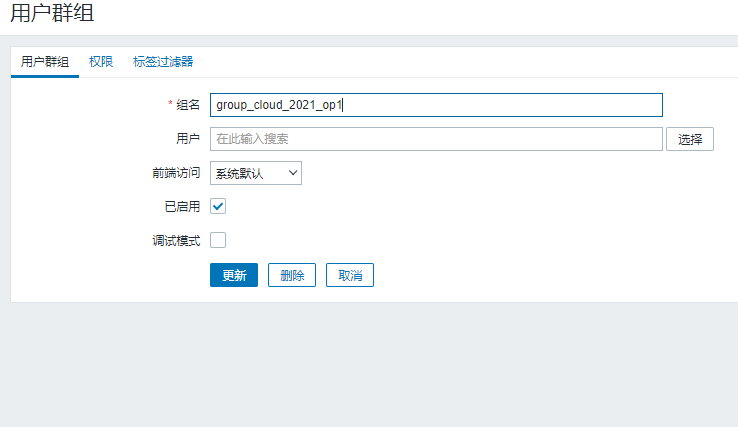
密码自定义


告警类型

设置告警


设置动作：触发器产生的告警


多个条件会有逻辑关系


设置一旦模板发生问题，每隔60秒就发送邮件给用户1


```bash
{TRIGGER.STATUS}: {TRIGGER.NAME}

告警主机:{HOST.NAME}
主机地址:{HOST.IP}
告警时间:{EVENT.DATE} {EVENT.TIME}
告警等级:{TRIGGER.SEVERITY}
告警信息:{TRIGGER.NAME}
问题详情:{ITEM.NAME}:{ITEM.VALUE}
事件代码:{EVENT.ID}
```


当事件升级，发送给更高级用户。


##### 微信告警


获取企业ID： ww88cfc4e6401f9bb0 https://work.weixin.qq.com/wework_admin/loginpage_wx?from=myhome


AgentID：1000003

Secret： FrmpVSXIt8kokhQJ9neNSQwti-ZeTcFhWqzifvBWvuA


vim  /usr/lib/zabbix/alertscripts/wechat.py

chown zabbix:zabbix /usr/lib/zabbix/alertscripts/wechat.py

```python
#!/usr/bin/env python
# -*- coding: utf-8 -*-
import urllib,urllib2,json
import sys
reload(sys)
sys.setdefaultencoding( "utf-8" )
class WeChat(object):
        __token_id = ''
        # init attribute
        def __init__(self,url):
                self.__url = url.rstrip('/')
                self.__corpid = 'ww88cfc4e6401f9bb0'
                self.__secret = 'FrmpVSXIt8kokhQJ9neNSQwti-ZeTcFhWqzifvBWvuA'
        # Get TokenID
        def authID(self):
                params = {'corpid':self.__corpid, 'corpsecret':self.__secret}
                data = urllib.urlencode(params)
                content = self.getToken(data)
                try:
                        self.__token_id = content['access_token']
                        # print content['access_token']
                except KeyError:
                        raise KeyError
        # Establish a connection
        def getToken(self,data,url_prefix='/'):
                url = self.__url + url_prefix + 'gettoken?'
                try:
                        response = urllib2.Request(url + data)
                except KeyError:
                        raise KeyError
                result = urllib2.urlopen(response)
                content = json.loads(result.read())
                return content
        # Get sendmessage url
        def postData(self,data,url_prefix='/'):
                url = self.__url + url_prefix + 'message/send?access_token=%s' % self.__token_id
                request = urllib2.Request(url,data)
                try:
                        result = urllib2.urlopen(request)
                except urllib2.HTTPError as e:
                        if hasattr(e,'reason'):
                                print 'reason',e.reason
                        elif hasattr(e,'code'):
                                print 'code',e.code
                        return 0
                else:
                        content = json.loads(result.read())
                        result.close()
                return content
        # send message
        def sendMessage(self,touser,message):
                self.authID()
                data = json.dumps({
                        "touser":"user",   
                        "toparty":"3",    
                        "msgtype":"text",
                        "agentid":"1000003", 
                        "text":{
							'content':message
                           },
                    	"safe":"0"
                },ensure_ascii=False)
                response = self.postData(data)
                print response
if __name__ == '__main__':
        a = WeChat('https://qyapi.weixin.qq.com/cgi-bin')
        a.sendMessage(sys.argv[1],sys.argv[3])
```

```bash
[root@zabbix_server alertscripts]# ./wechat.py Jocker test test
{u'msgid': u'mrVtVXE39it1tWVvd57npNzElVA2MgYok9Pc-PiVh1kIAhi7-jUDlWEyhZ-7G_7CuSBmcdanBYORruEw_ycDdg', u'invaliduser': u'user', u'errcode': 0, u'errmsg': u'ok'}


[用户] [title] [内容]
```


```bash
{TRIGGER.STATUS}: {TRIGGER.NAME}
告警主机:{HOST.NAME}
主机地址:{HOST.IP}
告警时间:{EVENT.DATE} {EVENT.TIME}
告警等级:{TRIGGER.SEVERITY}
告警信息:{TRIGGER.NAME}
问题详情:{ITEM.NAME}:{ITEM.VALUE}
事件代码:{EVENT.ID}
```

#### 远程执行

当问题发生时，可以通过远程执行命令的形式对目标主机进行控制

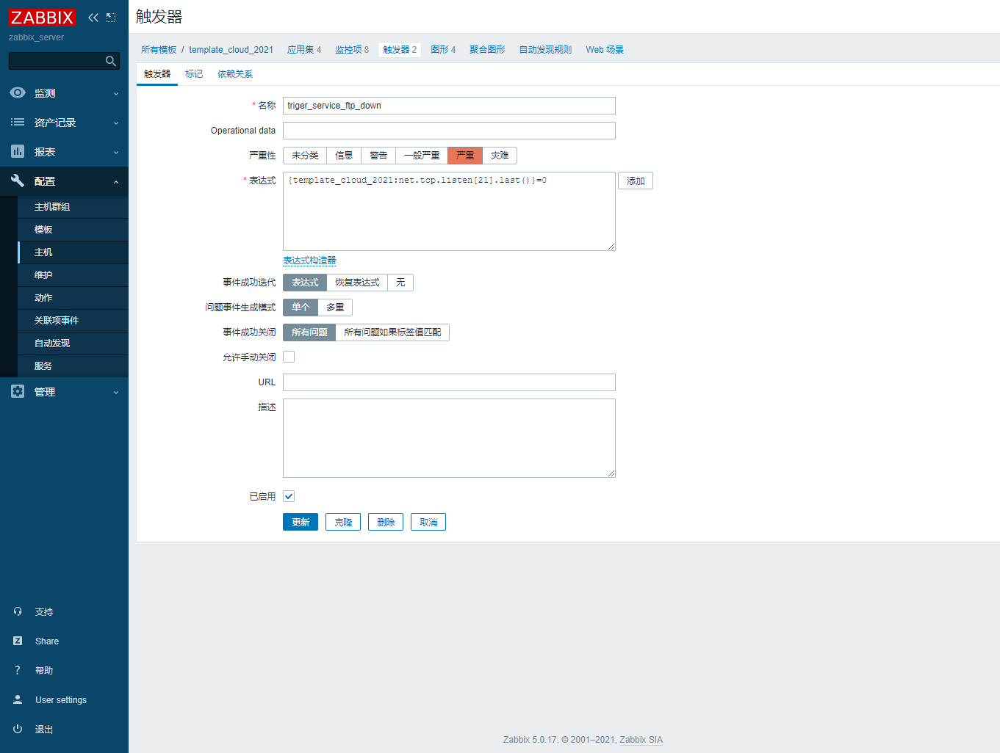


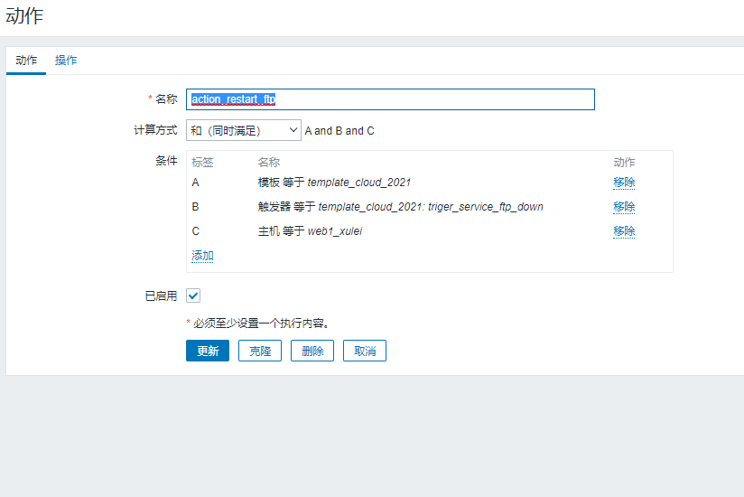


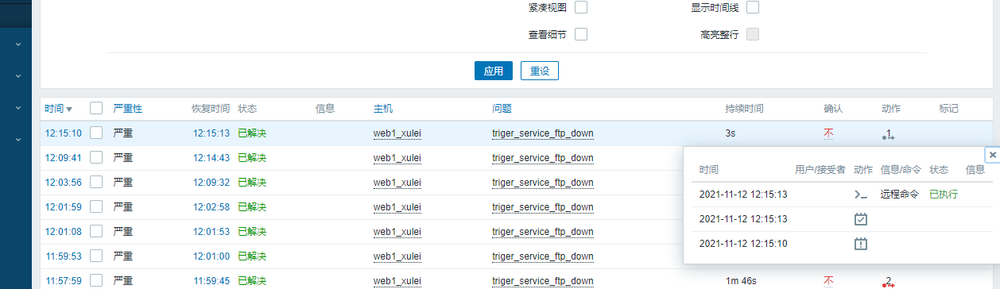

### Zabbix Macros 内置宏

https://www.zabbix.com/documentation/5.0/zh/manual/config/notifications/action/operation/macros

```php
## 主机相关
{HOSTNAME1}  告警主机
{HOST.IP}  主机IP
{HOST.METADATA}   设备元数据（自动注册的时候会发这种宏的通知给你）

## 时间相关
{DATE}  当前时间
{EVENT.DATE} {EVENT.TIME} 告警时间


## 触发器相关
{TRIGGER.SEVERITY} 触发器告警等级
{TRIGGER.NAME}  触发器名
{TRIGGER.KEY1}  触发器告警项目
{TRIGGER.STATUS}  触发器状态

## 监控项相关
{ITEM.NAME}:{ITEM.VALUE}   监控项名

## 动作（ Action）相关
{ACTION.ID}     Action(动作)的数字标识
{ACTION.NAME}   Action(动作)名

## 自动发现相关
{DISCOVERY.DEVICE.IPADDRESS}  被发现的设备地址
{DISCOVERY.DEVICE.STATUS}  被发现设备的状态: 可能是Up 或 Down

## 事件（EVENT)相关
{EVENT.ACK.STATUS}  事件的确认状态
{EVENT.AGE}  触发动作的事件持续时间
{EVENT.ID}  触发动作的事件数字标识
{EVENT.STATUS} 触发动作的事件状态
```

### Zabbix 自动发现


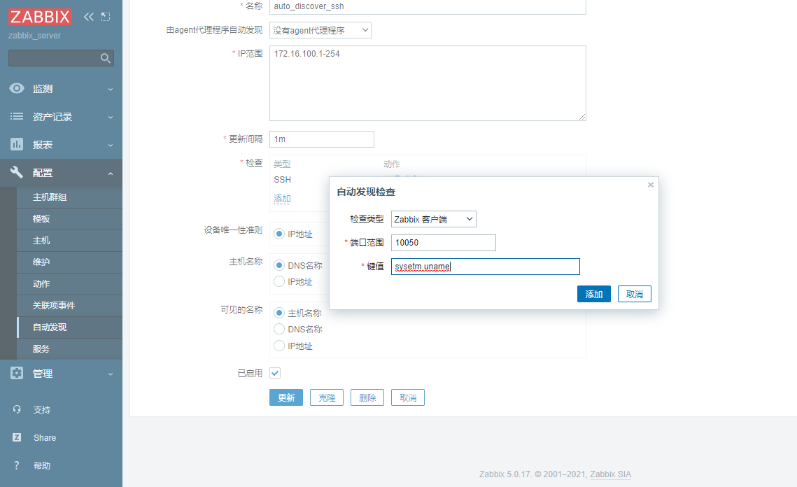

自动发现动作

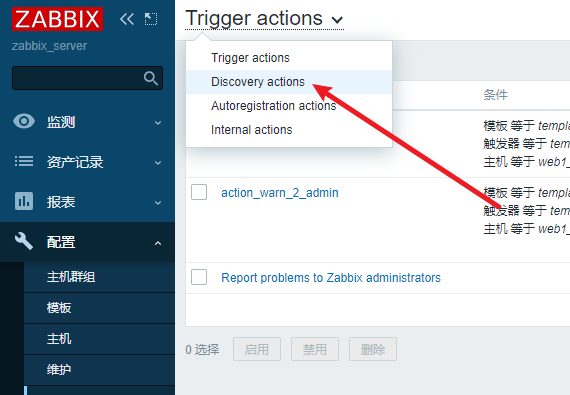


发现的主机在哪


### Zabbix自动注册

由客户端主动发起，客户端必须安装Agentd。否则无法被自动注册添加至主机列表

zabbix_agent 配置

vim /etc/zabbix/zabbix_agentd.conf

```bash
ServerActive=192.168.0.110 主动模式 zabbix-server-ip
```

systemctl restart zabbix-agentd


## 实战：TCP连接状态监控

状态码：

```bash
握手：
1-SYN_SENT 发送syn握手

2-LISTEN 监听
 V
2-SYN_REVND 发送同步

1-ESTABLISHED 完成连接
2-ESTABLISHED 完成连接

数据传输：
1-write
2-read

挥手：
1-FIN_WAIT-1 开始等待1

2-CLOSE_WAIT 关闭等待
V
2-LAST_ACK 最后询问[若无回复,倒数秒表自动关闭]

1-FIN_WAIT-2 开始等待2
V
1-TIME_WAIT

2-TIME_WAIT
```

工具 

netstat an

```bash
多少个连接
netstat -anpt | grep ESTABLISHED | wc -l
```

agent：

vim /etc/zabbix/zabbix_agentd.d/userparamenter_mysql.conf

```bash

UserParameter=tcp.status.ESTABLISHED,netstat -anpt | grep ESTABLISHED | wc -l
UserParameter=tcp.status.TIME_WAIT,netstat -anpt | grep TIME_WAIT | wc -l
```


## 实战：TCP连接状态监控2


agent:

vim /etc/zabbix/zabbix_agentd.d/userparamenter_mysql.conf

```bash
UserParameter=tcp.status.[*],netstat -anpt | grep "$1" | wc -l

$1 = 前方第一个[方括号里的内容]

```


高级用法

vim /etc/zabbix/zabbix_agentd.conf中增加

```bash
UserParameter=tcp.status[*],/etc/zabbix/scripts/tcp_conn_status.sh $1

```


```bash
chmod a+x /etc/zabbix/scripts/tcp_conn_status.sh
```

```bash
case $1 in  
   closed)  
          output=$(awk '/CLOSED/{print $2}' $tmp_file)  
          if [ "$output" == "" ];then  
             echo 0  
          else  
             echo $output  
          fi  
        ;;  
   listen)  
          output=$(awk '/LISTEN/{print $2}' $tmp_file)  
          if [ "$output" == "" ];then  
             echo 0  
          else  
             echo $output  
          fi  
        ;;  
   synrecv)  
          output=$(awk '/SYN_RECV/{print $2}' $tmp_file)  
          if [ "$output" == "" ];then  
             echo 0  
          else  
             echo $output  
          fi  
        ;;  
   synsent)  
          output=$(awk '/SYN_SENT/{print $2}' $tmp_file)  
          if [ "$output" == "" ];then  
             echo 0  
          else  
             echo $output  
          fi  
        ;;  
   established)  
          output=$(awk '/ESTABLISHED/{print $2}' $tmp_file)  
          if [ "$output" == "" ];then  
             echo 0  
          else  
             echo $output  
          fi  
        ;;  
   timewait)  
          output=$(awk '/TIME_WAIT/{print $2}' $tmp_file)  
          if [ "$output" == "" ];then  
             echo 0  
          else  
             echo $output  
          fi  
        ;;  
   closing)  
          output=$(awk '/CLOSING/{print $2}' $tmp_file)  
          if [ "$output" == "" ];then  
             echo 0  
          else  
             echo $output  
          fi  
        ;;  
   closewait)  
          output=$(awk '/CLOSE_WAIT/{print $2}' $tmp_file)  
          if [ "$output" == "" ];then  
             echo 0  
          else  
             echo $output  
          fi  
        ;;  
   lastack)  
          output=$(awk '/LAST_ACK/{print $2}' $tmp_file)  
          if [ "$output" == "" ];then  
             echo 0  
          else  
             echo $output  
          fi  
         ;;  
   finwait1)  
          output=$(awk '/FIN_WAIT1/{print $2}' $tmp_file)  
          if [ "$output" == "" ];then  
             echo 0  
          else  
             echo $output  
          fi  
         ;;  
   finwait2)  
          output=$(awk '/FIN_WAIT2/{print $2}' $tmp_file)  
          if [ "$output" == "" ];then  
             echo 0  
          else  
             echo $output  
          fi  
         ;;  
         *)  
          echo -e "\e[033mUsage: sh  $0 [closed|closing|closewait|synrecv|synsent|finwait1|finwait2|listen|established|lastack|timewait]\e[0m"  
     
```


## 一份生产配置


