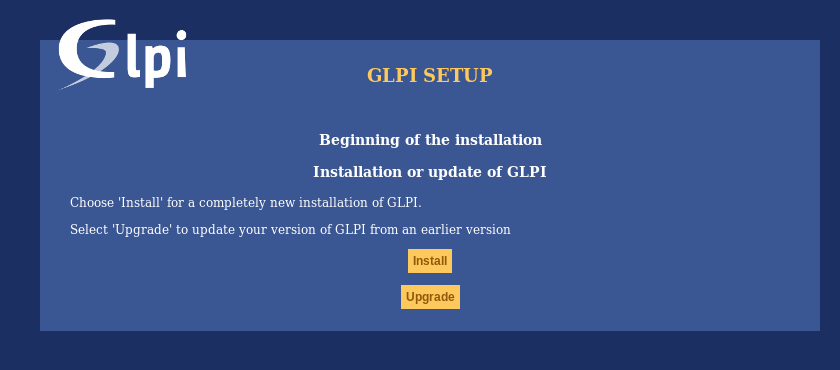
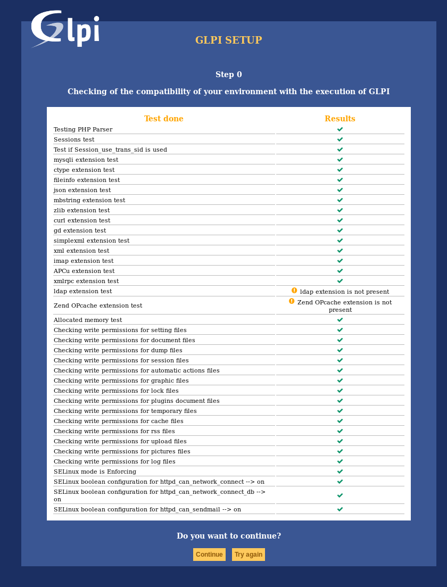
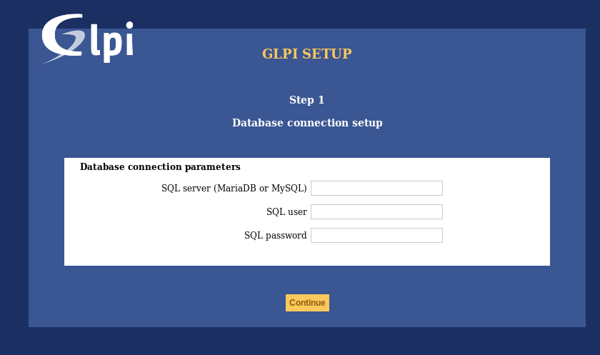
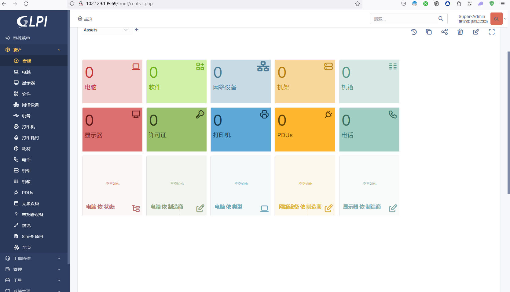

# Glpi-开源的IT资源管理平台部署

> GLPI 是一款免费的资产和IT管理软件套件，集数据中心管理、ITIL服务台、许可证跟踪和软件审计功能于一身。

## 部署前的准备

> https://glpi-install.readthedocs.io/en/latest/prerequisites.html

为了部署和运行GLPI，以下是所需的系统要求和建议配置：

| 要求类别      | 具体要求                        |
| ------------- | ------------------------------- |
| Web服务器     | Apache, Nginx, IIS 或其他       |
| 数据库        | MariaDB >= 10.5 或 MySQL >= 8.0 |
| PHP版本兼容性 | GLPI 9.5.x：PHP 7.2 至 8.0      |
|               | GLPI 10.0.x：PHP 7.4 至 8.3     |
|               | GLPI 10.1.x：PHP 8.2 至 8.3     |

| **强制性PHP扩展** |                                 |
| ----------------- | ------------------------------- |
| dom               | 启用                            |
| fileinfo          | 启用                            |
| json              | 启用                            |
| session           | 启用                            |
| simplexml         | 启用                            |
| curl              | 访问远程资源所需                |
| gd                | 图片处理                        |
| intl              | 国际化支持                      |
| libxml            | XML处理                         |
| mysqli            | 数据库通信                      |
| zlib              | 压缩通信与文件处理              |


| **建议PHP扩展**   |                                 |
| ----------------- | ------------------------------- |
| exif              | 图像安全验证强化                |
| ldap              | LDAP身份验证支持                |
| openssl           | SSL/TLS邮件发送                 |
| zip               | 市场包安装支持                  |
| bz2               | 同上                            |


| **支持的浏览器**  |                                 |
| ----------------- | ------------------------------- |
| Microsoft Edge    | 最新版本                        |
| Firefox           | 包括最近两个ESR版本             |
| Google Chrome     | 最新版本                        |

这里我选择系统默认版本的Nginx、MySQL 5.7、php7.2进行部署。

操作系统选择Ubuntu

### MySQL数据库部署

>  安装docker版本的MySQL 5.7数据库

#### 部署docker

```bash
curl -sSL get.docker.com | bash
```

#### 部署MySQL并持久存储数据

```bash
docker run \
    --name mysql5.7 \
    -p 3306:3306 \
    --restart always \
    -e MYSQL_ROOT_PASSWORD=@fFQN2kICMxx \
    -v /data/mysql:/var/lib/mysql \
    -d \
    mysql:5.7
```

### Nginx部署

> 直接部署默认版本即可

```bash
apt update && apt install -y nginx
```

### PHP部署

```bash
apt update && apt install -y php7.4 php7.4-fpm php7.4-dev
```

## 进入安装流程

### 正式版安装包

创建存储目录

```bash
cd /var/www/
wget https://github.com/glpi-project/glpi/releases/download/10.0.16/glpi-10.0.16.tgz
tar -zxvf glpi-10.0.16.tgz
chown www-data:www-data glpi
```

### 创建nginx配置文件

```bash
cd /etc/nginx
编辑nginx.conf文件注释掉  
#       include /etc/nginx/sites-enabled/*;
```

创建conf.d/glpi.conf写入以下内容

```bash
server {
    listen 80;
    listen [::]:80;

    #server_name glpi.localhost;

    root /var/www/glpi/public;

    location / {
        try_files $uri /index.php$is_args$args;
    }

    location ~ ^/index\.php$ {
        # the following line needs to be adapted, as it changes depending on OS distributions and PHP versions
        fastcgi_pass unix:/run/php/php-fpm.sock;

        fastcgi_split_path_info ^(.+\.php)(/.*)$;
        include fastcgi_params;

        fastcgi_param SCRIPT_FILENAME $document_root$fastcgi_script_name;
    }
}

```

重载nginx配置

```bash
nginx -s reload
```

### 创建php配置文件

```bash
vim /etc/php/7.4/fpm/php.ini


设置 一行 
session.cookie_httponly = 1  

```

重载配置

```bash
systemctl restart php7.4-fpm.service
```


### 浏览器安装

https://IP_ADDR/


#### 选择语言


#### 证书


#### 安装




#### 环境检查

> 必须保证所有的必须检查项为成功
>
> bz2 zip模块为建议模块，可以不安装
>
> 



#### 数据库连接




填写你的ip地址，用户名填写root，密码填写 上面创建创建数据库的密码

```bash
ip.address.xxx.xxx
root
@fFQN2kICMxx
```

#### 继续下一步

直到出现

```bash
Default user accounts are:
    glpi/glpi admin account,
    tech/tech technical account,
    normal/normal “normal” account,
    post-only/postonly post-only account.
```


## 安装成功


