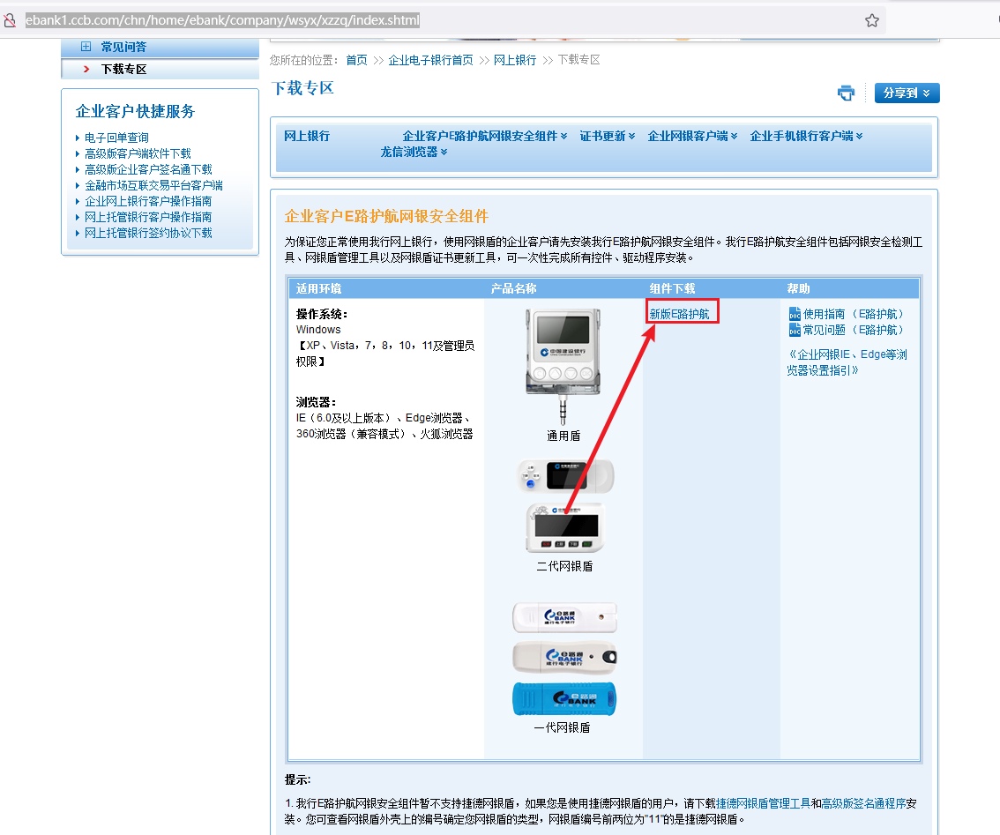
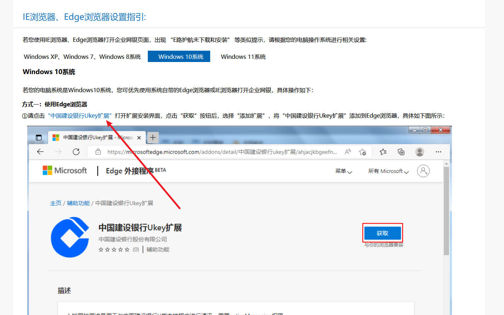
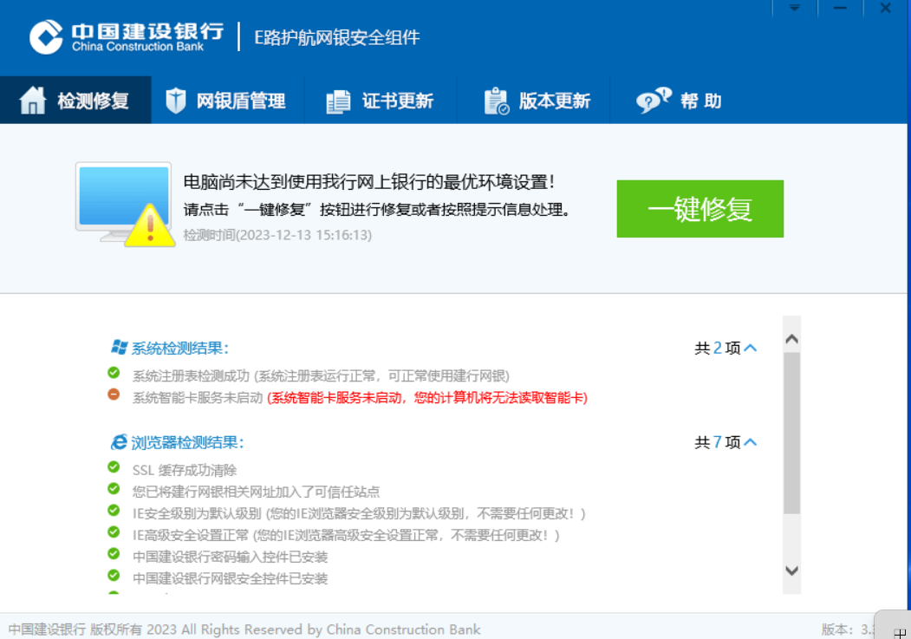
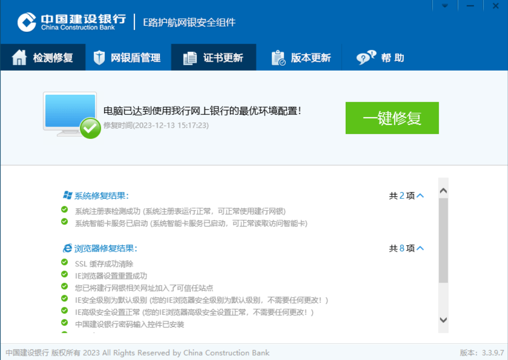
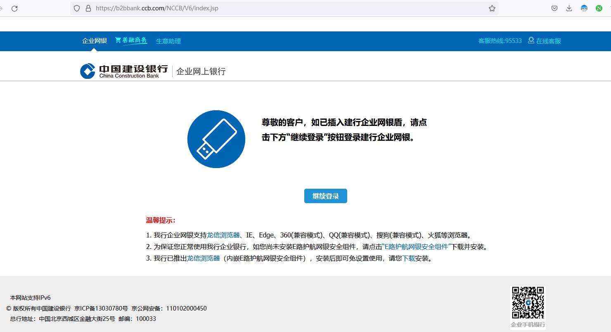

# 中国建设银行u盾使用教程

> 因为建设银行落后的系统，使用Windows 7操作系统是百分百成功，其他os不成功。不建议尝试。

## step1

在链接 http://ebank1.ccb.com/chn/home/ebank/company/wsyx/xzzq/index.shtml

下载驱动 **E路护航网银安全组件**

## step2

安装浏览器插件，Windows默认未edge浏览器。

点击链接安装插件 [ccb.com/cn/html1/office/ebank/dzb/subject/qywyzy/qywyzy.html](http://www.ccb.com/cn/html1/office/ebank/dzb/subject/qywyzy/qywyzy.html)

## step3

打开上一步安装的软件，点击检测按钮。然后点击修复按钮，直到全部选项显示为绿色。

## step4

插入u盾到usb口，将会自动弹出网页,选中证书并确认，将会弹出密码输入窗口。u盾即可正常使用。

