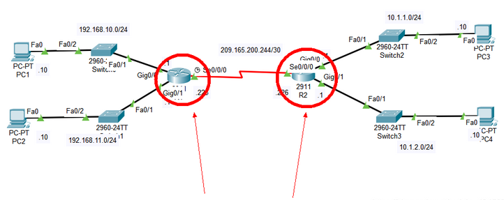

# Cisco路由器配置静态路由

> 本文档介绍了如何在Cisco路由器（R1和R2）上配置静态路由，以确保它们能够正确地相互通信。我们将详细讲解如何在两台路由器上设置静态路由，包括具体的配置步骤和验证命令。

## 拓扑图

在此拓扑中，我们有两个路由器（R1和R2），它们通过Serial0/0/0接口连接，并且它们之间的通信需要通过静态路由来实现。




## R1的配置

### 进入特权模式

```bash
R1> enable
```

### 进入全局配置模式

```bash
R1# configure terminal
```

### 配置静态路由

添加静态路由，将目的网络和子网掩码与下一跳地址关联。以下命令配置了到达 `10.1.1.0/30` 和 `10.1.2.0/30` 网络的静态路由，下一跳地址为 `209.165.200.224`：

```bash
R1(config)# ip route 10.1.1.0 255.255.255.252 209.165.200.224
R1(config)# ip route 10.1.2.0 255.255.255.252 209.165.200.224
```

### 查看路由表

使用 `show ip route` 命令查看路由表，确保静态路由已经添加：

```bash
R1(config)# do show ip route
```

示例输出：

```bash
Codes: L - local, C - connected, S - static, R - RIP, M - mobile, B - BGP
       D - EIGRP, EX - EIGRP external, O - OSPF, IA - OSPF inter area
       N1 - OSPF NSSA external type 1, N2 - OSPF NSSA external type 2
       E1 - OSPF external type 1, E2 - OSPF external type 2, E - EGP
       i - IS-IS, L1 - IS-IS level-1, L2 - IS-IS level-2, ia - IS-IS inter area
       * - candidate default, U - per-user static route, o - ODR
       P - periodic downloaded static route

Gateway of last resort is not set

     10.0.0.0/24 is subnetted, 2 subnets
S       10.1.1.0/24 [1/0] via 209.165.200.224
S       10.1.2.0/24 [1/0] via 209.165.200.224
     192.168.10.0/24 is variably subnetted, 2 subnets, 2 masks
C       192.168.10.0/24 is directly connected, GigabitEthernet0/0
L       192.168.10.1/32 is directly connected, GigabitEthernet0/0
     192.168.11.0/24 is variably subnetted, 2 subnets, 2 masks
C       192.168.11.0/24 is directly connected, GigabitEthernet0/1
L       192.168.11.1/32 is directly connected, GigabitEthernet0/1
     209.165.200.0/24 is variably subnetted, 2 subnets, 2 masks
C       209.165.200.224/30 is directly connected, Serial0/0/0
L       209.165.200.225/32 is directly connected, Serial0/0/0
```

### 退出配置模式并保存配置

```bash
R1(config)# exit
R1# write memory
Building configuration...
[OK]
```

## R2的配置

### 进入特权模式

```bash
R2> enable
```

### 进入全局配置模式

```bash
R2# configure terminal
```

### 配置静态路由

添加静态路由，将目的网络和子网掩码与下一跳地址关联。以下命令配置了到达 `192.168.10.0/30` 和 `192.168.11.0/30` 网络的静态路由，下一跳地址为 `209.165.200.225`：

```bash
R2(config)# ip route 192.168.10.0 255.255.255.252 209.165.200.225
R2(config)# ip route 192.168.11.0 255.255.255.252 209.165.200.225
```

### 退出配置模式并保存配置

```bash
R2(config)# exit
R2# write memory
Building configuration...
[OK]
```

## 总结

在R1和R2上配置静态路由可以确保两个路由器之间的网络流量能够正确地转发。通过这些配置命令，你可以有效地管理和维护网络的路由路径。

## 参考

- [Cisco路由配置手册](https://www.cisco.com/c/en/us/support/docs/ip/ip-routing/1163-1.html)
- [静态路由基础](https://www.cisco.com/c/en/us/td/docs/ios/12_4/iproute/command/reference/irp_r.html)

