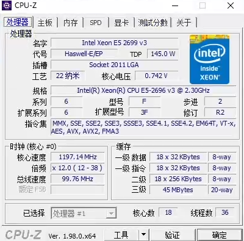
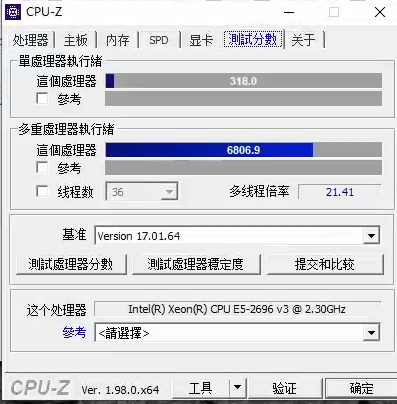
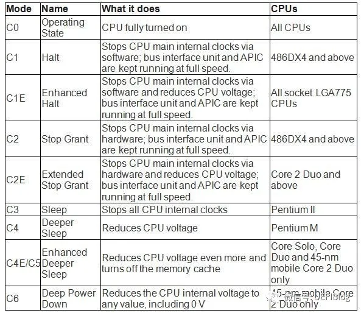
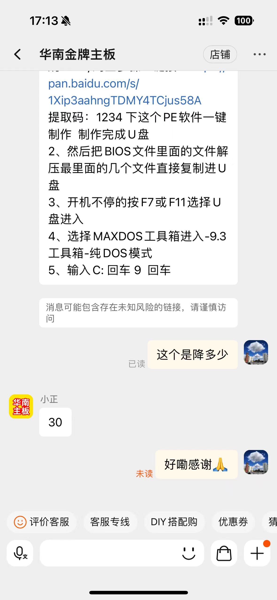
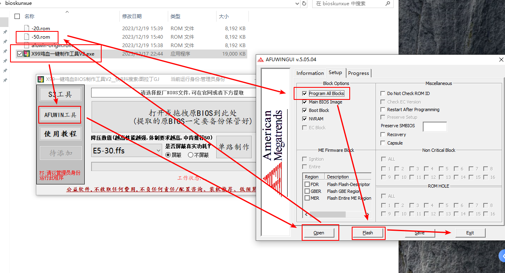

# CPU鸡血BIOS

鸡血bios能提升性能，获得更大好处。现在对一些关键操作的参数进行解释。

这是我们本文的主角

参数介绍

2696v3是e5 v3系列最强的cpu 它是2699v3的 oem定制版
2699v3是 18核36线程  睿频  （ 12-36）单核3.6G 全核2.8G  tdp 145w
2696v3是  18核36线程  睿频  （12-38）  单核3.8G 全核 2.8G tdp  145w
所以他们唯一的区别就四单核睿频从3.6g提升到了3.8G
但是因为E5 V3鸡血bios的出现 可以全核最大睿频 即单核3.6G就可以全核3.6G 单核3.8G就可以全核3.8G.但是全核睿频功耗不能超过tdp功耗 就是145w 所以18核满载超过145w就会降频 

CPU-Z性能测试

## CPU状态 CStates

EIST全名Enhanced Intel SpeedStep Technology（增强型Intel  SpeedStep技术），是Intel的新节能技术。和早期的SpeedStep技术不同，增强型的EIST技术可以动态调整CPU频率，随着CPU使用率地下或者接近0时候降低CPU频率并且降压，从而降低功耗和发热。一旦检测到CPU使用率高，立马回复原始工作频率。 

| 状态 | 通意               | 含义                                                         |
| ---- | ------------------ | ------------------------------------------------------------ |
| C1E  | 空闲时降频率和电压 | 系统闲置状态时的CPU节能功能                                  |
| C3   | 空闲时降频率和电压 | C3 状态（深度睡眠） 总线频率和 PLL 均被锁定 在多核心系统下，缓存无效 在单核心系统下，内存被关闭，但缓存仍有效 可以节省 70% 的 CPU 功耗，但平台功耗比 C2 状态下大一些 唤醒时间需要 50 微秒 |
| C6   | 空闲时降频率和电压 | C6 状态 二级缓存减至零后， CPU 的核心电压更低 不保存 CPU context 功耗未知，非常低接近零 唤醒时间未知 |

深度解密CState看这里，

- https://zhuanlan.zhihu.com/p/25675639
- https://www.intel.cn/content/www/cn/zh/support/articles/000006619/processors/intel-core-processors.html

## 电源管理状态

浅谈Sleep S3
1.电源管理的SX状态和GX状态：

❷SX状态：
● S0 ：实际上这就是我们平常的工作状态，在OS下的运行状态。
● S1 ：也称作为 POS （ power on suspend ），这时通过 CPU 时钟控制器将 CPU 关闭外，其他，外设都正常工作。
● S2 ：这个状态除了 CPU 被关闭之外，总线时钟也是处于关闭的状态，但是其他的外设还是都处于正常的工作状态的。
● S3 ：就是 我们熟悉的 STR （ Suspend to Ram ） , 也就是待机 到内存， CPU 和外设电源被关
闭，只有内存处于自刷新状态。就是笔记本合上屏幕的状态 。
● S4 ：被称为 STD （ suspend to Disk ）, 待机到硬盘， CPU 和外设电源被关闭（硬盘处于工作
状态），将内存的数据保存到硬盘中并可以被唤醒。
● S5 ：就是关机的状态。
❷GX状态：
G 状态 Global system state
● G0 运行模式。向硬件提供电源，软件可以运行的状态。
● G1 停止模式。所谓的待机或休眠状态。
● G2 软件为关闭状态，应将消耗若干电力状态。
● G3 系统完全关闭，电源关闭的状态。即不插电源的S5状态。
————————————————
原文链接：https://blog.csdn.net/weixin_44964658/article/details/133790845

## 电源管理状态和CPU状态的关系

> 我理解的是CPU电源是电源管理的一部分，CPU自己本身节能，然后电源管理可以从上而下关闭电源（CPU几乎断电），这时CState将会全部失效

G0（S0）：正常工作状态 c0：正常工作状态（又包含P1-P16：性能状态，在intel处理器中称为speedstep）
c1：通常称Halt，有c1e(Enhanced Halt State，增强型C1状态)
c2：通常称stop-clock
c3：通常称sleep
G1：睡眠（S1-S4） S1：最耗电睡眠模式，将淘汰
S2：更深睡眠状态，不被采用
S3：挂到内存（suspend to RAM/STR），也叫待机（standby）和睡眠（sleep）
S4：挂到硬盘，也称休眠，类似G2 soft off 和G3 Machanical off
G2（S5）：soft off
G3：Machanical off
————————————————
原文链接：https://blog.csdn.net/youshun20/article/details/115480953

## 鸡血原理

E5 v3因为MSR寄存器的bug，导致可以通过删除MC来操纵睿频，俗称“鸡血”，很多寨板厂家也提供鸡血BIOS，但是鸡血BIOS往往不能解决TDP问题，导致有些体质较差的E5v3不能跑满最大睿频，这个现象在AVX负载下尤为明显

## 功耗破墙

> 参考 https://tieba.baidu.com/p/7919847934

功耗的限制，intel的Xeon默认情况下是以TDP为最高上限的，短时间允许其运行在TDP以上20%。

比如E5-2696v3，这个CPU，TDP是145W，默认PL1是145W，PL2是175W，持续时间为45s，这个参数是固定的，在BIOS里面设置没有用处，并不能改变PL1和PL2

而E5-2696v3这个CPU的单核最大睿频是3.8Ghz，鸡血之后空载全核3.8Ghz，一旦进行任何程度的负载就会被145W的TDP压制住，根据体质不同，2696v3的SSE负载频率从3.1～3.5不等，大雕可以3.5Ghz跑R15或者CPU-Z，大雷只能3.1Ghz，AVX负载的频率在2.7～3.1不等，我的2696v3就是一颗大雷。

经过测试之后，破除TDP墙的办法是删除系统文件mcupdate_GenuineIntel.dll

这个文件是intel微码更新。参考这个[https://support.microsoft.com/zh-cn/topic/kb4497165-intel-](http://jump.bdimg.com/safecheck/index?url=rN3wPs8te/pZF1vzXGG8W793U5re5eHk7Bb0vpq75FrqJSYuk0BDhvl+oeq0+rfD7NXEAqvWIhtYAbuY08jyGK6EU8uNey0oSaOzRbDmZJJaG7idURJvY6rQ4SXdKmUIRP0oWCCaagxyGjPW0iegznzXB1RCIIp/ea+8QMlqrwVn2am2F0Owc4hLConyc5Z3dj2oeHoEzTI=)微代码更新-100229c5-e199-37bb-031f-9faa76daa07a

## 刷bios降压升频率

> 删除一些微码

鸡血补丁是一种通过修改CPU的微代码来提高处理器性能的方式。具体来说，这个补丁可以删除一些微码，使处理器在运行时不再受到某些限制，从而让CPU的所有核心以更高的频率运行。但是，这个补丁并不会突破处理器的 TDP  上限，也就是说，CPU的功耗不会超过其设计规格。因此，使用鸡血补丁可以在一定程度上提高CPU的性能，但也需要注意系统稳定性和功耗散热等问题。

在这里提一嘴，华南的官方客服真的好啊。板子是2019年买的 x99-ad3 ，官方客服只要求拍照主板，就能得到官方鸡血bios。

看到帖子上他们坏了的主板直接返厂维修。不得不佩服，很有大厂作风。

官方鸡血bios到手，官方鸡血是 -30mv

## 民间鸡血bios

> 资源列表
>
> - 教程 https://www.bilibili.com/video/BV15G41197jv

来自bilibili的一个up制作了x99平台的所有通用鸡血bios，自动化删除微码，自动破除功耗墙。

我制作了-50 mv 的 bios

## 民间bios刷入

> 按照图片中箭头顺序点击，
>
> 重点： 点击Flash后双手离开键盘，不要点击任何东西。等待刷完

## 成果展示（硬核生产力）

TODO: 还没刷，忐忑的很。