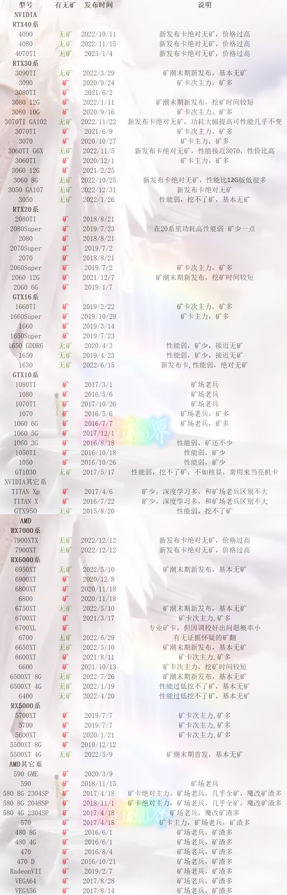

# GPU矿卡体质检测

> 矿难已过，便宜显卡满天飞。 矿卡价格确实很香，同时坑也很多。我准备做一次垃圾佬踩一下这些坑。
>
> 作为一个垃圾佬，最喜欢体验这一些机遇与风险并存刺激的东西。
>
> 于是，我购买了一片 AMD 讯景 RX6600XT 花费 1179.00元，店保2年，看起来非常诱人。这价格还要啥自行车？就是用着用着爆了，我都能夸它爆的真响。
>
> 享受价格红利的同时也不能忘记巨大风险的存在，我们如何为矿卡检测体质呢？这是本文的主题。

矿卡型号一览表 来自 https://www.bilibili.com/read/cv21654310/

## 预先准备

设置

- gpu 2775
- vram 2138
- tdp 190w

TODO: 补充图片

## 外观查看

外观崭新和外观及其陈旧的都要警惕起来，

**首先从外观崭新开始讲起**，因为矿潮红利，产量的不足和利润的驱使，官方发布了非常多的翻新产品。

矿卡翻新依旧是锻炼过的显卡核心，质量并没有很大保证，依旧是矿卡体质。

我们要警惕崭新显卡，极有可能是官方睁一只眼闭一只眼发布的翻新卡。

所以我们**不要花新卡的价钱去买矿卡型号的新卡即使是** *官方旗舰店*、

**其次是外观极其陈旧**，这件事情还要从矿潮开始说起，因为挖矿是显卡24小时甚至几个月不停的运转，损耗极其的大，外观就可能。

矿难发生的时间是：2022年9月15日。

具体的事件始末，可能一般新手玩家不感兴趣。简单说就是，之前所谓的矿潮，就是可以用显卡（主要是显存）来挖ETF（以太坊）币，然后在2022年9月15日，以太坊做了合并，升级成2.0，不再使用这种显卡挖矿的方式了，一夜之间，所有的显卡就不能再挖以太坊币了（具体原理不解释，我也解释不清）。于是矿难就发生了。

这件事上要从矿卡的发布时间上说起，**看显卡上面的时间，然后对比矿难结束时间，然后我们能够基本得出显卡服役了多久，这时矿卡体质也容易得出**。

## 闻闻味道

如果是大修卡，更换过元器件，必定存在焦糊的味道。就算是高超的水洗技术，也不可能完全的洗去焦糊的味道。

我们一定要避坑这种卡，大修卡稳定性极差。

## SN检测法

盒子码，显卡码，官方码三码合一，包括出厂时间也必须一致。

如果查不到，或者核对失败，这个卡必定有一些古怪，避坑！

## 金手指辨别法

矿卡一般插上去就一直服役到去世，金手指甚至只插过一次。你懂哦

## 甜甜圈烤坤（烤鸡）

> 据说甜甜圈是某程序员不小心造了个bug出来的软件，消耗GPU极大，后来成为了显卡压力测试软件。

甜甜圈，官方名**Furmark**。可以测试显卡的极限温度以及稳定性，如果没有出现闪屏，或者黑屏以及花屏等情况，那么测试就是通过的。

TODO: 补充图片

## 3D Mark 20轮通过率

主要测试稳定性，如果是矿卡，大多数会有暗病，很难顺利通过测试，再进行DX12 20轮循环测试，可以看出显卡的体质，如果是优秀的分数会在99%以上，低于97%的体质表示不合格。

TODO: 补充图片

