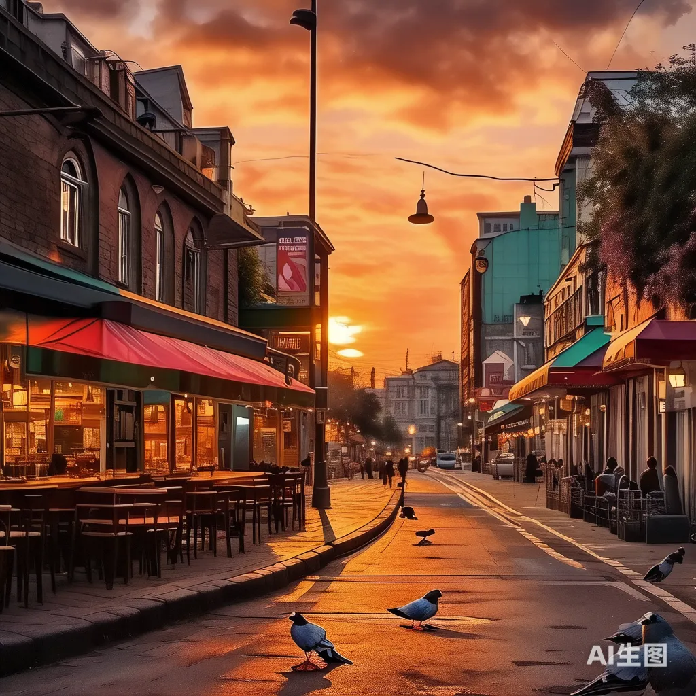
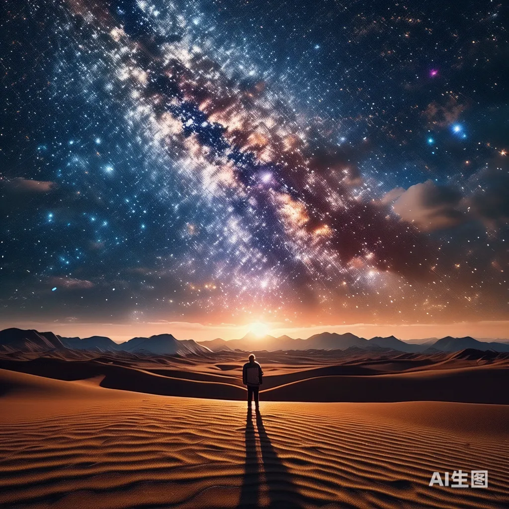

# 孤独与信仰：我们该如何面对

​	有一种药，如果吃了就能彻底治愈，不再需要继续服用。我们称这种药为解药或良药。然而，如果有一种药，你吃了之后还会想吃，想要更多，甚至希望每天都服用，并希望身边的人也一同分享，这绝对不是解药，而是毒药。而我所知道，这种药叫做信仰。

​	信仰为何如此诱人？因为信仰紧紧抓住了人类的软肋——孤独。信仰承诺了一个美好的未来和幻境，以安抚我们对孤独的恐惧。然而，我们必须明白，孤独不仅仅是一种修辞，它更是一种真实的感受。因此，如果你不想感到孤独，就不要总想着“终将”。享受当下的每一刻，不要在夏天思考秋天，不要在相聚时忧虑离别。但如果你想深入思考人生的终极意义，就不可避免地要面对孤独。

​	你问我，我身边朋友朋友父亲最孤独的那一刻是哪一刻？是我朋友父亲48岁那一年，那是他的第四个本命年。我的朋友的奶奶因突发心肌梗塞去世。人在极度悲痛的背后，往往会陷入一种平静。在火葬场回家的路上，他的父亲非常平静地说了一句：“妈走了，家散了。”那一年夏天，随着拖拉机的轰鸣，我朋友家的老街被推平。老街曾承载了他父亲的青春，也承载了他的童年。

​	尽管现在他们逢年过节依旧团团聚聚，一起吃饭，对方说：“你看，其实家没有散，因为我家现在逢年过节也是一家子团团聚聚，一起吃饭。其实老街也没有散，因为现在那一条老街被更繁华的星巴克和麦当劳所占据。”然而，我知道那一刻，世界上再也没有人记得我朋友的父亲是如何长大的了。没有任何记忆能够填补前面的一段记忆。

​	我们有时觉得自己不孤独，觉得自己特别完整、自足和满足，但其实，我们并不是完整的个体，而是因为每一片碎片都有一个地方和一个人替我们珍藏。可是，我要告诉大家的是，终有一天，这些触角将永远消失。就像90后开始失去了，00后开始失去了，互联网也开始坍缩了，总有一天我们都会失去。今天，青春年少时我们风光无限，风雨无阻。我们不断收集碎片，有些碎片可以和别人的拼接，拼接成越来越大的版图。然而，终有一天，我们转头一看，会发现满目疮痍，曾经的记忆已被遗忘。

​	最终，没有人能够告诉我们，我们是从何而来，我们将向何处去。因为没有人能活着告诉我们死亡的真实感受。人生最悲哀的事，莫过于终将变成孤儿。在时间的维度面前，人类不过是时间的孤儿。然而，这恰恰是人类最幸运的事情。因为人终将成为孤儿，所以我们不可依赖于天赋，也不寻找上帝。只有我是自己的主人
只有我能是自己的主人，那一刻，我感受到了孤独给予我的自由。
