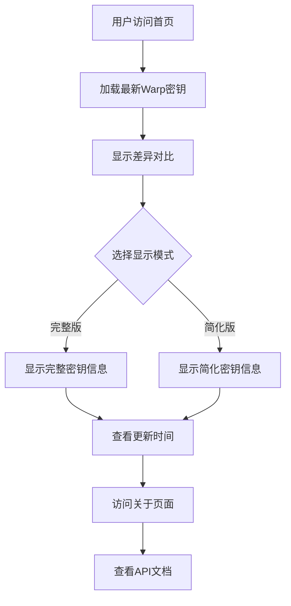

## 1. 产品概述
WarpKey自动获取与展示平台，每小时自动更新最新的Warp密钥，提供可视化差异对比界面。用户可通过Web界面或API获取密钥，支持完整版和简化版两种展示模式。

解决手动获取Warp密钥的繁琐问题，为开发者和用户提供便捷的密钥获取渠道，提升使用体验。

## 2. 核心功能

### 2.1 用户角色
本项目为公共服务，无需用户注册登录，所有用户均可免费访问。

### 2.2 功能模块
WarpKey平台包含以下核心页面：
1. **首页**：展示最新的Warp密钥列表，支持差异对比显示
2. **关于页面**：项目介绍、使用说明、API文档
3. **API接口**：提供完整版和简化版两种数据格式

### 2.3 页面详情

| 页面名称 | 模块名称 | 功能描述 |
|---------|---------|---------|
| 首页 | 密钥展示区域 | 显示最新获取的Warp密钥，支持自动刷新，新增密钥用绿色标记，删除的密钥用红色标记 |
| 首页 | 版本对比 | 显示当前版本与上一版本的差异对比，类似Git提交记录 |
| 首页 | 模式切换 | 提供完整版(full)和简化版(lite)两种显示模式切换 |
| 首页 | 更新时间 | 显示最后更新时间，下次更新倒计时 |
| 关于页面 | 项目介绍 | 介绍项目背景、功能特点、技术栈 |
| 关于页面 | API文档 | 提供API接口说明、请求示例、响应格式 |
| 关于页面 | 使用指南 | 详细说明如何使用Web界面和API接口 |

## 3. 核心流程

用户访问流程：
1. 用户访问首页，自动加载最新的Warp密钥
2. 系统每小时自动获取最新密钥并更新数据库
3. 页面实时显示密钥变更情况（新增/删除）
4. 用户可切换完整版/简化版视图
5. 用户可访问关于页面了解项目详情和API使用

## 4. 用户界面设计

### 4.1 设计风格
- **主色调**：深蓝色 (#1e40af) 作为品牌色，白色背景
- **强调色**：绿色 (#10b981) 表示新增，红色 (#ef4444) 表示删除
- **按钮样式**：圆角矩形，使用shadcn/ui组件库
- **字体**：Inter字体，标题24-32px，正文16px
- **布局风格**：卡片式布局，顶部导航栏，响应式网格

### 4.2 页面设计概览

| 页面名称 | 模块名称 | UI元素 |
|---------|---------|---------|
| 首页 | 导航栏 | 左侧Logo，右侧导航菜单（首页、关于），深色主题切换按钮 |
| 首页 | 密钥展示 | 卡片式布局，每个密钥独立卡片，显示密钥内容、获取时间、状态标识 |
| 首页 | 差异对比 | 类似Git diff的视觉效果，左侧显示上一版本，右侧显示当前版本 |
| 首页 | 控制面板 | 模式切换按钮、刷新按钮、更新时间显示、倒计时组件 |
| 关于页面 | 头部区域 | 项目标题、简介、GitHub链接 |
| 关于页面 | 内容区域 | 分段式卡片布局，包含项目介绍、API文档、使用指南 |

### 4.3 响应式设计
采用桌面端优先设计，完全适配移动端：
- 桌面端：1200px以上，多列网格布局
- 平板端：768-1199px，双列布局
- 移动端：767px以下，单列布局，优化触摸交互

### 4.4 动效设计
- 页面加载：骨架屏过渡动画
- 密钥更新：淡入淡出效果
- 差异对比：平滑过渡动画
- 模式切换：内容渐变切换