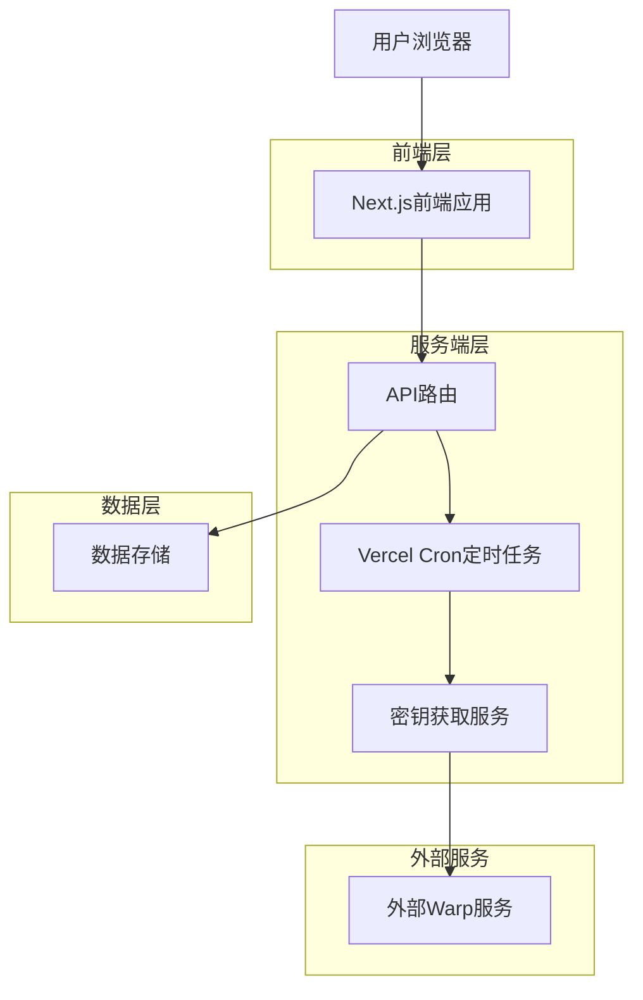
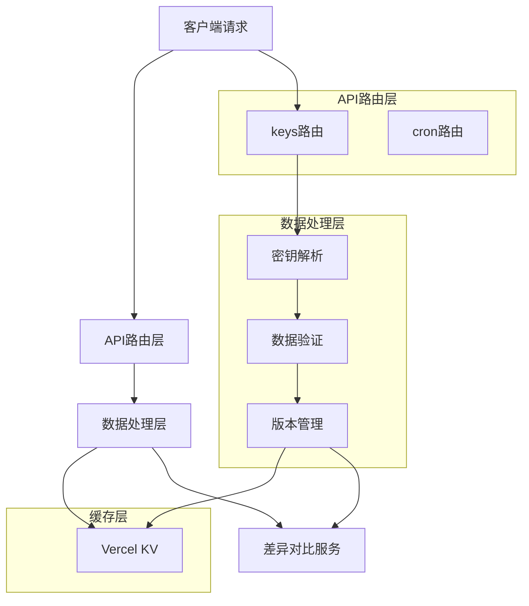
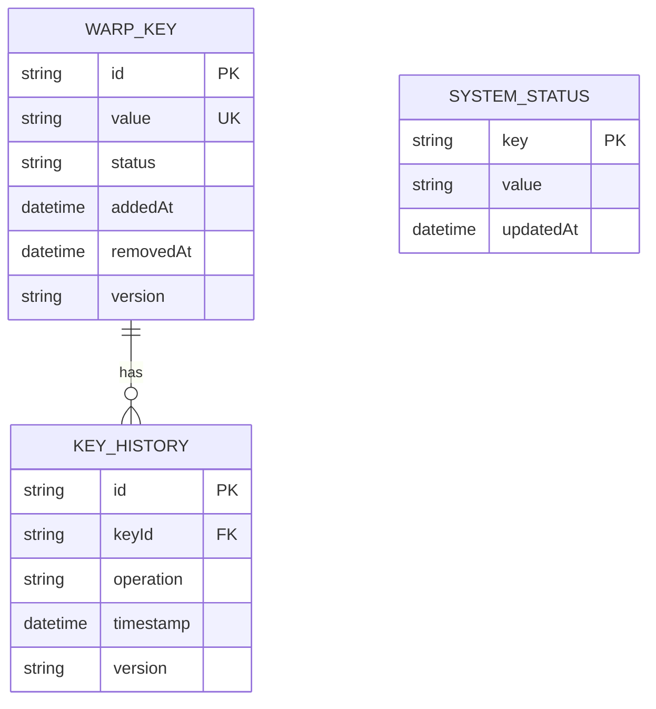

## 1. 架构设计



## 2. 技术栈描述

- **前端框架**: Next.js 14 + React 18
- **样式框架**: Tailwind CSS 3 + shadcn/ui
- **初始化工具**: create-next-app
- **部署平台**: Vercel
- **定时任务**: Vercel Cron Jobs
- **数据存储**: Vercel KV (Redis)

## 3. 路由定义

| 路由 | 用途 |
|------|------|
| / | 首页，展示Warp密钥列表 |
| /about | 关于页面，项目介绍和API文档 |
| /api/keys | API接口，获取最新密钥 |
| /api/keys/lite | API接口，获取简化版密钥 |
| /api/cron/fetch-keys | 定时任务接口，每小时更新密钥 |

## 4. API定义

### 4.1 核心API

获取完整版密钥
```
GET /api/keys
```

响应参数:
| 参数名 | 参数类型 | 描述 |
|--------|----------|------|
| keys | array | 密钥数组 |
| lastUpdated | string | 最后更新时间 |
| version | string | 数据版本 |

示例响应:
```json
{
  "keys": [
    {
      "id": "key1",
      "value": "warp://example.com:1234",
      "addedAt": "2024-01-01T12:00:00Z",
      "status": "active"
    }
  ],
  "lastUpdated": "2024-01-01T12:00:00Z",
  "version": "v1.0.0"
}
```

获取简化版密钥
```
GET /api/keys/lite
```

响应参数:
| 参数名 | 参数类型 | 描述 |
|--------|----------|------|
| keys | array | 简化密钥数组，仅包含密钥值 |
| count | number | 密钥数量 |
| lastUpdated | string | 最后更新时间 |

示例响应:
```json
{
  "keys": ["warp://example1.com:1234", "warp://example2.com:5678"],
  "count": 2,
  "lastUpdated": "2024-01-01T12:00:00Z"
}
```

## 5. 服务端架构



## 6. 数据模型

### 6.1 数据模型定义



### 6.2 数据结构定义

密钥数据模型:
```typescript
interface WarpKey {
  id: string;
  value: string;
  status: 'active' | 'removed';
  addedAt: Date;
  removedAt?: Date;
  version: string;
}

interface KeyHistory {
  id: string;
  keyId: string;
  operation: 'added' | 'removed';
  timestamp: Date;
  version: string;
}

interface SystemStatus {
  lastUpdate: Date;
  nextUpdate: Date;
  keyCount: number;
  version: string;
}
```

Vercel KV存储结构:
```
# 当前密钥
kv:warp:keys:current -> WarpKey[]

# 历史版本
kv:warp:keys:history:{version} -> KeyHistory[]

# 系统状态
kv:warp:system:status -> SystemStatus

# 差异对比
kv:warp:diff:{version} -> DiffResult
```

## 7. 定时任务配置

Vercel Cron Jobs配置:
```json
{
  "crons": [
    {
      "path": "/api/cron/fetch-keys",
      "schedule": "0 * * * *"
    }
  ]
}
```

## 8. 部署配置

环境变量:
```env
# Vercel配置
VERCEL_URL=
VERCEL_ENV=

# 外部服务配置
WARP_API_ENDPOINT=
WARP_API_KEY=

# 缓存配置
KV_URL=
KV_REST_API_URL=
KV_REST_API_TOKEN=
```

## 9. 性能优化

- 使用ISR(Incremental Static Regeneration)优化页面加载
- 密钥数据缓存1小时，减少外部API调用
- 使用Vercel Edge Functions优化API响应速度
- 实现数据压缩，减少传输大小
- 添加错误重试机制，提高服务稳定性